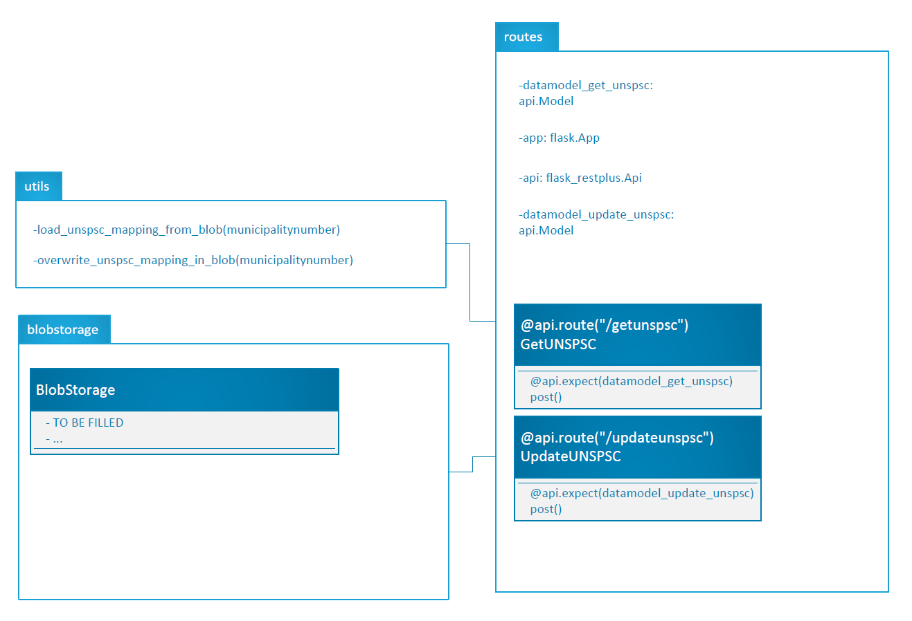
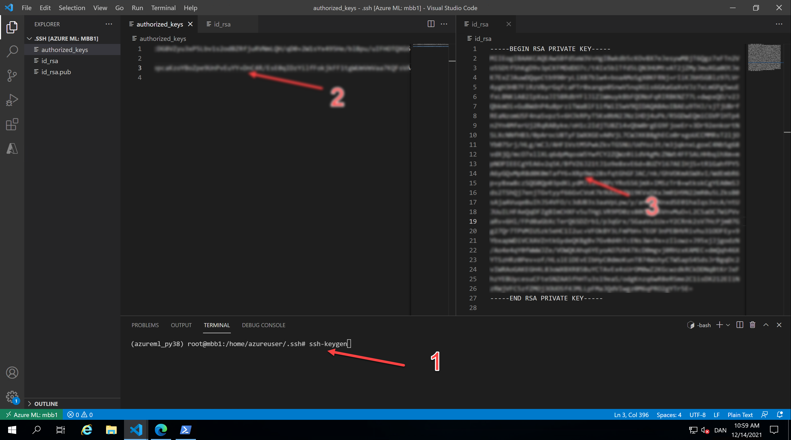
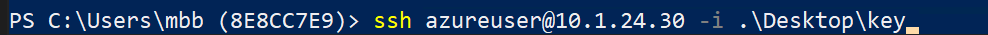

# Introduction 
MapUNSPSC is a small RESTfull api with a file backend that serves the purpose of mapping GL accounts to UNSPSC codes.

# TODO ->

# Getting Started
TODO: Guide users through getting your code up and running on their own system. In this section you can talk about:
1.	Installation process
2.	Software dependencies
3.	Latest releases
4.	API references

# Build and Test
In order to interact with the REST api via a browser it is necessary to do a couple of steps.

1. Create ssh-keypair
2. Move private key to jumphost
3. ssh with port forward from jumphost to compute instance
4. Go to browser localhost:port

Sceenshot

SSH cmd

# Contribute
TODO: Explain how other users and developers can contribute to make your code better. 

If you want to learn more about creating good readme files then refer the following [guidelines](https://docs.microsoft.com/en-us/azure/devops/repos/git/create-a-readme?view=azure-devops). You can also seek inspiration from the below readme files:
- [ASP.NET Core](https://github.com/aspnet/Home)
- [Visual Studio Code](https://github.com/Microsoft/vscode)
- [Chakra Core](https://github.com/Microsoft/ChakraCore)